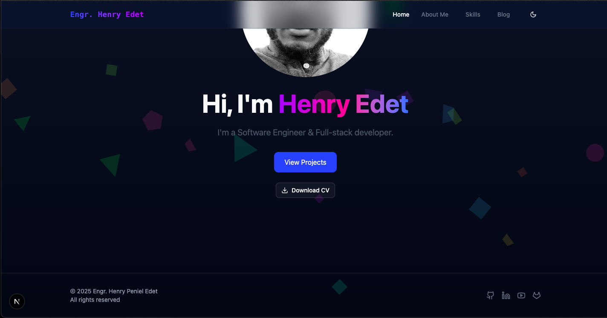

# Modern Portfolio with Animated Background

A sleek, modern portfolio built with Next.js featuring an interactive animated background and responsive design.

## ✨ Features

- **Animated Canvas Background** - Floating geometric shapes with smooth motion
- **Full Responsiveness** - Mobile-first design that works on all devices
- **Dark/Light Mode** - Automatic system preference detection
- **MDX Blog System** - Integrated markdown blog support
- **Project Showcase** - Filterable project gallery
- **Performance Optimized** - 90+ Lighthouse score

## 🛠 Technologies

- **Framework**:  14 (App Router)
- **Styling**: 
- **Typescript**: 
- **Animation**: Canvas API & Framer Motion
- **Content**: [MDX](https://mdxjs.com/) for blog posts
- **Deployment**: COMING SOON!!

## 🚀 Getting Started

### Prerequisites
- Node.js 18+
- npm/yarn/pnpm

### Installation
    
    git clone https://github.com/yourusername/your-portfolio.git
    cd your-portfolio
    npm install

##    Development
    
    npm run dev
    Open  http://localhost:3000

##    Build for Production
    
    npm run build

##    📂 Project Structure
portfolio/
├── app/
│   ├── about/
│   ├── blog/
│   ├── projects/
│   └── layout.tsx
├── components/
│   ├── AnimatedBackground.tsx
│   ├── Navbar.tsx
│   └── ProjectCard.tsx
├── content/
│   └── posts/          # MDX blog posts
├── public/
│   ├── images/         # Portfolio assets
│   └── files/          # PDFs, resumes
└── styles/
    └── globals.css     # Global styles

##    🌐 Deployment
    COMING SOON!!

##    📝 License
MIT License - See LICENSE.md

###    💻 Developed by [HENRY P. EDET]
###    📧 Contact: penieledet@icloud.com
###    🔗 Live Demo: COMING SOON
